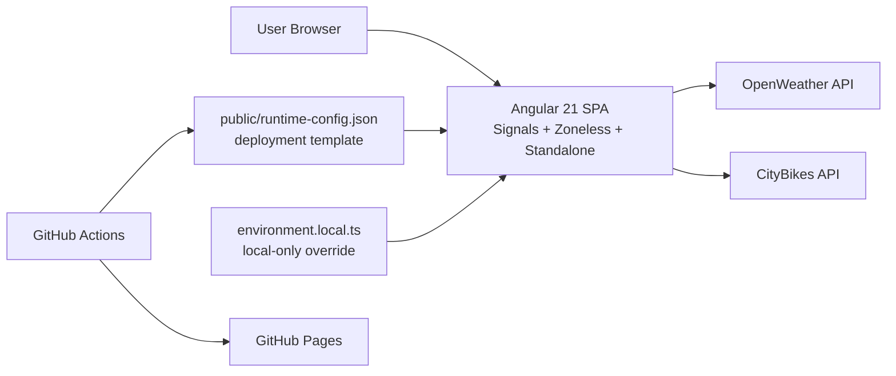
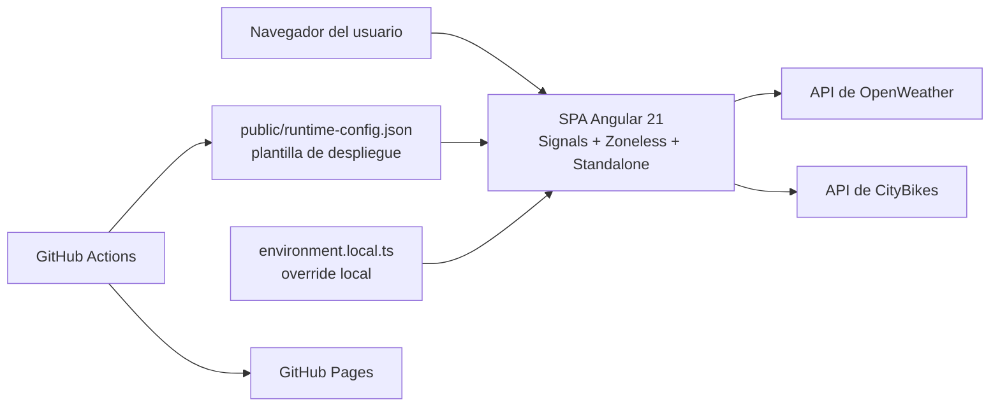

# EcoTransit Explorer


- Live URL / URL de despliegue: [https://lrangela.github.io/eco-transit-explorer/](https://lrangela.github.io/eco-transit-explorer/)

## English

### Real Problem

Urban users need a lightweight way to check current weather conditions and bike-sharing availability before leaving home. The constraint is deliberate: this project must work with free-tier public APIs, frontend-only hosting, and no custom backend.

### Solution

EcoTransit Explorer is a frontend-only Angular 21 application that:

- shows current weather and 5-day forecast from OpenWeather
- compares up to 3 cities to stay inside free-tier request limits
- shows BiciMAD bike-sharing station availability from CityBikes
- loads runtime configuration at startup so deployment-specific values do not require rebuilding the source

### Architecture



### Stack

- Angular 21
- TypeScript 5.9
- Standalone components
- Signals, `resource`, and `rxResource`
- Zoneless change detection
- PrimeNG + PrimeIcons
- Vitest for unit tests
- Playwright + AXE for E2E and accessibility smoke tests
- GitHub Actions + GitHub Pages

### Technical Decisions

- Frontend-only integration: weather and bike data are consumed directly from the browser because the deployment target is static hosting.
- Runtime configuration: `public/runtime-config.json` is injected at deploy time, while `src/environments/environment.local.ts` is reserved for local-only overrides.
- Free-tier guardrails: city comparison is capped at 3 cities to avoid abusing free API quotas.
- Honest transit scope: the transit feature is explicitly bike-sharing availability, not bus or metro ETA.
- Bundle reduction: route-level lazy loading plus `@defer` is used for non-critical widgets such as forecast and comparison results.
- No tracked secrets: real API keys must never be committed.

### Highlighted Features

- Current weather search with reactive input and retry-safe error handling
- 5-day forecast loaded progressively
- Multi-city comparison with free-tier-safe limits
- BiciMAD station availability with explicit empty/error separation
- Runtime feature flags for optional sections
- Accessibility smoke coverage with AXE

### How to Run

1. Install dependencies:

   ```bash
   npm install
   ```

2. Create the local override file:

   ```bash
   copy src\environments\environment.local.example.ts src\environments\environment.local.ts
   ```

3. Add your OpenWeather API key to `src/environments/environment.local.ts`.

4. Start the app:

   ```bash
   npm run start:local
   ```

5. Open `http://localhost:4200/`.

### How to Deploy

Production deploy is handled by GitHub Actions.

1. Configure the repository secret:

   - `OPENWEATHER_API_KEY`

2. Optional repository variables:

   - `OPENWEATHER_BASE_URL`
   - `OPENWEATHER_UNITS`
   - `OPENWEATHER_LANGUAGE`

3. Push to `main`.

The workflow:

- runs `npm ci --legacy-peer-deps`
- validates runtime config
- runs unit, smoke, and E2E tests
- injects `runtime-config.json`
- builds the Angular app
- deploys to GitHub Pages

### Documentation

- [API integration](docs/API_INTEGRATION.md)
- [Local setup](docs/LOCAL_SETUP.md)
- [Zoneless architecture ADR](docs/adr/ADR-001-zoneless-architecture.md)
- [Documentation governance ADR](docs/adr/ADR-002-documentation-governance.md)
- [Data fetching ADR](docs/adr/ADR-003-data-fetching-strategy.md)

## Español

### Problema real

Los usuarios urbanos necesitan una forma ligera de revisar el clima actual y la disponibilidad de bicicletas compartidas antes de salir. La restricción es intencional: este proyecto debe funcionar con APIs públicas en plan gratuito, hosting estático y sin backend propio.

### Solución

EcoTransit Explorer es una aplicación Angular 21 frontend-only que:

- muestra clima actual y pronóstico de 5 días desde OpenWeather
- compara hasta 3 ciudades para mantenerse dentro de los límites del plan gratuito
- muestra disponibilidad de estaciones BiciMAD desde CityBikes
- carga configuración runtime al iniciar para no recompilar el código por cada despliegue

### Arquitectura



### Stack

- Angular 21
- TypeScript 5.9
- Componentes standalone
- Signals, `resource` y `rxResource`
- Detección de cambios zoneless
- PrimeNG + PrimeIcons
- Vitest para pruebas unitarias
- Playwright + AXE para E2E y smoke de accesibilidad
- GitHub Actions + GitHub Pages

### Decisiones técnicas

- Integración frontend-only: clima y bicicletas se consumen directamente desde el navegador porque el destino de despliegue es hosting estático.
- Configuración runtime: `public/runtime-config.json` se inyecta en despliegue y `src/environments/environment.local.ts` queda reservado para overrides locales.
- Límites del plan gratuito: comparison está limitado a 3 ciudades para no abusar de la cuota.
- Alcance honesto de transit: el módulo es disponibilidad de bike-sharing, no ETA de bus o metro.
- Reducción de bundle: se usa lazy loading por rutas y `@defer` en widgets no críticos como forecast y resultados de comparison.
- Sin secretos versionados: nunca debe existir una API key real en el repositorio.

### Features destacadas

- Búsqueda de clima actual con input reactivo y manejo de errores con reintento
- Pronóstico de 5 días cargado de forma progresiva
- Comparación multi-ciudad con límites seguros para el plan gratuito
- Disponibilidad de estaciones BiciMAD con separación explícita entre vacío y error
- Feature flags runtime para secciones opcionales
- Cobertura smoke de accesibilidad con AXE

### Cómo correr

1. Instala dependencias:

   ```bash
   npm install
   ```

2. Crea el archivo local:

   ```bash
   copy src\environments\environment.local.example.ts src\environments\environment.local.ts
   ```

3. Agrega tu API key de OpenWeather en `src/environments/environment.local.ts`.

4. Inicia la app:

   ```bash
   npm run start:local
   ```

5. Abre `http://localhost:4200/`.

### Cómo desplegar

El despliegue de producción se resuelve con GitHub Actions.

1. Configura el secreto del repositorio:

   - `OPENWEATHER_API_KEY`

2. Variables opcionales:

   - `OPENWEATHER_BASE_URL`
   - `OPENWEATHER_UNITS`
   - `OPENWEATHER_LANGUAGE`

3. Haz push a `main`.

El workflow:

- ejecuta `npm ci --legacy-peer-deps`
- valida la configuración runtime
- corre pruebas unitarias, smoke y E2E
- inyecta `runtime-config.json`
- compila la aplicación Angular
- despliega en GitHub Pages

### Documentación

- [Integración API](docs/API_INTEGRATION.md)
- [Setup local](docs/LOCAL_SETUP.md)
- [ADR de arquitectura zoneless](docs/adr/ADR-001-zoneless-architecture.md)
- [ADR de gobierno documental](docs/adr/ADR-002-documentation-governance.md)
- [ADR de estrategia de data fetching](docs/adr/ADR-003-data-fetching-strategy.md)
