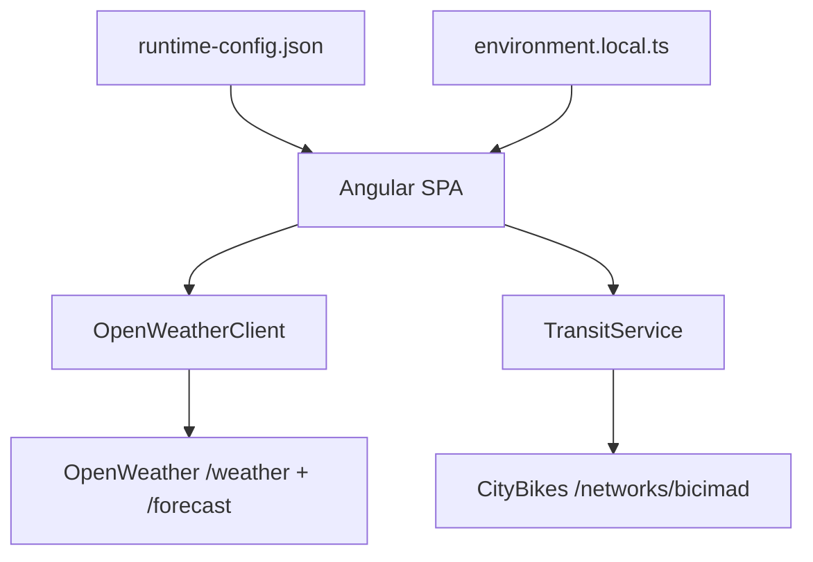
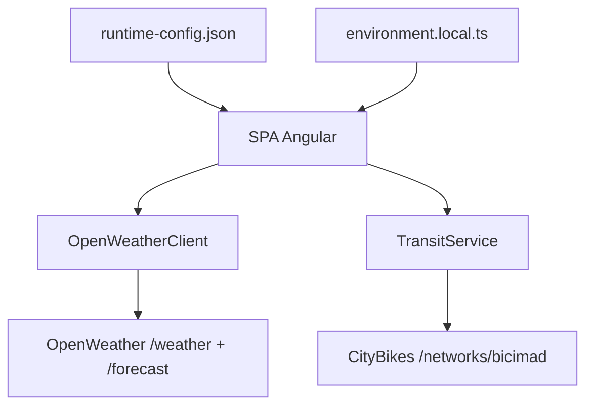

# API Integration

## English

### Real Problem

The application must consume weather and bike-sharing data while remaining deployable on GitHub Pages, which means there is no application backend available at runtime.

### Solution

The Angular client integrates directly with OpenWeather and CityBikes. Configuration is resolved at startup from a tracked runtime template plus an optional local override for developer machines.

### Architecture



### Stack

- `HttpClient`
- Angular signals
- `rxResource` for weather and transit streams
- `resource` for comparison orchestration
- runtime configuration service
- domain-level error mapping

### Technical Decisions

- `OpenWeatherClient` calls OpenWeather directly with `q`, `appid`, `units`, and `lang`.
- `TransitService` calls CityBikes directly and is intentionally scoped to bike availability.
- Runtime flags control feature availability without rebuild.
- Global HTTP toasts are suppressed for per-city comparison failures to avoid toast spam.
- Comparison is limited to 3 cities because the free weather tier is constrained.

### Endpoints

- `GET {weatherBaseUrl}/weather`
- `GET {weatherBaseUrl}/forecast`
- `GET {transitBaseUrl}/networks/bicimad`

### Runtime Configuration Contract

```json
{
  "api": {
    "weatherBaseUrl": "https://api.openweathermap.org/data/2.5",
    "weatherApiKey": "__OPENWEATHER_API_KEY__",
    "weatherUnits": "metric",
    "weatherLanguage": "en",
    "transitBaseUrl": "https://api.citybik.es/v2"
  },
  "features": {
    "comparison": true,
    "transit": true
  },
  "observability": {
    "consoleLogging": false
  }
}
```

### How to Run

- Local frontend-only:

  ```bash
  npm run start:local
  ```

- CI-like development mode:

  ```bash
  npm run start:dev
  ```

### How to Deploy

- CI writes `public/runtime-config.json` with `node scripts/write-runtime-config.mjs`
- GitHub Actions injects:
  - `OPENWEATHER_API_KEY`
  - optional base URL, units, and language values
- Static assets are published to GitHub Pages

### Highlighted Features

- direct runtime-configured weather integration
- local-only secret override
- direct bike network availability feed
- feature flags with `canMatch`
- retry-aware client error handling

## Español

### Problema real

La aplicación debe consumir datos de clima y bike-sharing manteniéndose desplegable en GitHub Pages, lo que implica que no existe un backend de aplicación en runtime.

### Solución

El cliente Angular se integra directamente con OpenWeather y CityBikes. La configuración se resuelve al inicio usando una plantilla runtime versionada y un override local opcional para la máquina del desarrollador.

### Arquitectura



### Stack

- `HttpClient`
- signals de Angular
- `rxResource` para flujos de clima y transit
- `resource` para la orquestación de comparison
- servicio de configuración runtime
- mapeo de errores a nivel de dominio

### Decisiones técnicas

- `OpenWeatherClient` llama directamente a OpenWeather con `q`, `appid`, `units` y `lang`.
- `TransitService` llama directamente a CityBikes y queda acotado intencionalmente a disponibilidad de bicicletas.
- Las feature flags runtime controlan módulos sin recompilar.
- Los toasts globales se suprimen en fallos parciales de comparison para evitar ruido.
- Comparison se limita a 3 ciudades por las restricciones del plan gratuito.

### Endpoints

- `GET {weatherBaseUrl}/weather`
- `GET {weatherBaseUrl}/forecast`
- `GET {transitBaseUrl}/networks/bicimad`

### Contrato de configuración runtime

```json
{
  "api": {
    "weatherBaseUrl": "https://api.openweathermap.org/data/2.5",
    "weatherApiKey": "__OPENWEATHER_API_KEY__",
    "weatherUnits": "metric",
    "weatherLanguage": "en",
    "transitBaseUrl": "https://api.citybik.es/v2"
  },
  "features": {
    "comparison": true,
    "transit": true
  },
  "observability": {
    "consoleLogging": false
  }
}
```

### Cómo correr

- Modo local frontend-only:

  ```bash
  npm run start:local
  ```

- Modo desarrollo similar a CI:

  ```bash
  npm run start:dev
  ```

### Cómo desplegar

- CI genera `public/runtime-config.json` con `node scripts/write-runtime-config.mjs`
- GitHub Actions inyecta:
  - `OPENWEATHER_API_KEY`
  - valores opcionales para base URL, unidades e idioma
- Los assets estáticos se publican en GitHub Pages

### Features destacadas

- integración directa de clima configurada en runtime
- override local con secreto no versionado
- feed directo de disponibilidad de bike-sharing
- feature flags con `canMatch`
- manejo de errores con reintentos controlados
